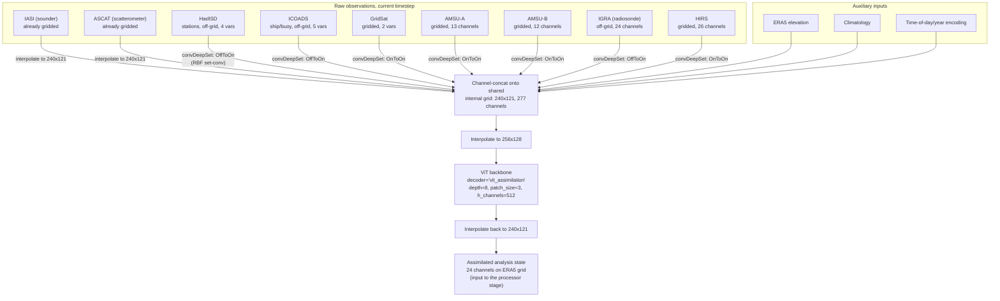
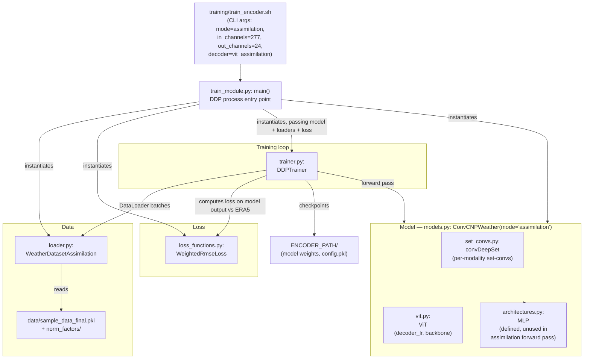
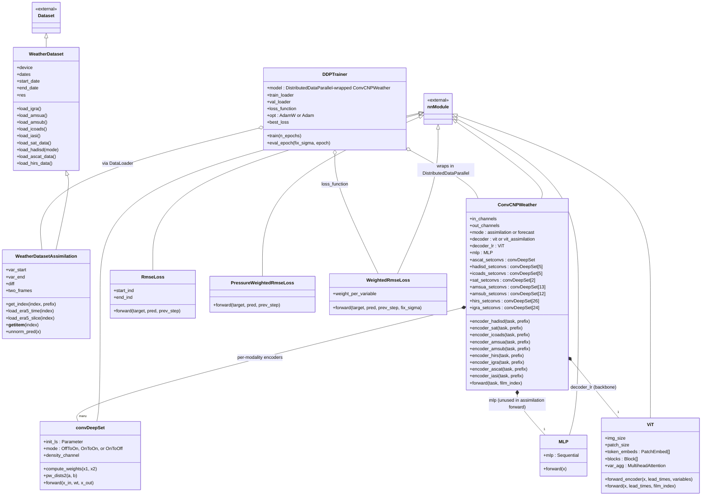

# Assimilation-Only Architecture

This describes the `ConvCNPWeather` model
([aardvark/models.py](../aardvark/models.py)) running in
`mode="assimilation"` — i.e. the **encoder** stage trained by
[training/train_encoder.sh](../training/train_encoder.sh)
(`--decoder vit_assimilation --in_channels 277 --out_channels 24`). This
stage ingests raw, irregularly-sampled observations from many instruments and
produces a single gridded analysis state — it does not forecast forward in
time or downscale to stations (that's the processor and decoder stages,
respectively).

## Diagram



## Key components

- **Set-convolutions (`convDeepSet`,
  [aardvark/set_convs.py](../aardvark/set_convs.py))** — the ConvCNP
  mechanism that turns each observation modality into a fixed-size gridded
  tensor on a shared internal grid (`int_grid`, 240×121 points spanning the
  globe). Each modality gets its own set-conv(s) per channel, with a learned
  RBF length-scale (`init_ls`). Two conversion modes are used here:
  - `OffToOn` — irregular point observations (HadISD, ICOADS, IGRA) → grid.
  - `OnToOn` — already-gridded but differently-resolved products (GridSat,
    AMSU-A/B, HIRS) → the shared internal grid.
  - IASI and ASCAT skip the set-conv and are directly interpolated, since
    they arrive pre-gridded at compatible resolution.
  - Every set-conv also emits a **density channel** marking where
    observations existed, so the model can distinguish "no data" from "zero
    value."

- **Auxiliary channels** — static elevation, a climatological prior, and a
  time encoding are broadcast to the grid and concatenated alongside the
  observation channels, giving `in_channels=277` total.

- **ViT backbone (`decoder_lr`, [aardvark/vit.py](../aardvark/vit.py))** —
  when `decoder="vit_assimilation"`, a Vision Transformer (depth 8,
  patch size 3, hidden size 512, no per-variable embedding) processes the
  concatenated 256×128 field and produces the 24-channel output
  (`out_channels=24`), representing the assimilated atmospheric state.

- **Grid resampling** — inputs are bilinearly interpolated 240×121 →
  256×128 before the ViT (patch-friendly resolution) and the ViT output is
  interpolated back down to 240×121 to match the ERA5 grid.

See [aardvark/models.py:308-390](../aardvark/models.py) (`ConvCNPWeather.forward`,
the `mode == "assimilation"` branch) for the exact code this diagram traces.

## Module / component diagram

The diagram above shows the *data-flow* through one forward pass. This shows
the *code modules* involved in training the encoder end to end, i.e. the
wiring performed by `training/train_encoder.sh` →
[aardvark/train_module.py](../aardvark/train_module.py) when
`--mode assimilation`.



- **`train_module.py`** is the single entry point shared by all three
  training modes (`assimilation`, `forecast`, `downscaling`); the `mode`
  argument selects which dataset class and which loss are wired up. For
  assimilation, that's `WeatherDatasetAssimilation` +
  `WeightedRmseLoss`/`PressureWeightedRmseLoss`.
- **`ConvCNPWeather`** ([models.py](../aardvark/models.py)) is the model
  class for both the encoder (`mode="assimilation"`) and processor
  (`mode="forecast"`) — see [aardvark/models.py:15](../aardvark/models.py).
  It composes the per-modality `convDeepSet` set-convolutions with a `ViT`
  backbone.
- **`DDPTrainer`** ([trainer.py](../aardvark/trainer.py)) is generic across
  modes too — it just runs the epoch loop, distributed sync, checkpointing,
  and validation against whatever model/loss/loaders it's handed.
- `misc_downscaling_functionality.py` (`ConvCNPWeatherOnToOff`) and
  `unet_wrap_padding.py` are imported by `train_module.py` but are only
  exercised in `mode="downscaling"` (decoder training) — not part of the
  assimilation path.

## Data flow diagram (training pipeline)

This traces the data itself — from raw files on disk through
normalization, batching, the model, and the loss — for one training step of
`WeatherDatasetAssimilation` ([loader.py:497](../aardvark/loader.py)).

```mermaid
flowchart LR
    subgraph RAW["Raw per-instrument arrays\n(loaded once in WeatherDataset.__init__)"]
        R1["ICOADS x/y"]
        R2["GridSat (sat) x/y"]
        R3["AMSU-A / AMSU-B x/y"]
        R4["IASI / ASCAT"]
        R5["HadISD x/y"]
        R6["IGRA x/y"]
        R7["HIRS x/y"]
        R8["ERA5 (era5_sfc)\nground truth"]
        R9["norm_factors/\n(mean_*.npy, std_*.npy)"]
    end

    R1 & R2 & R3 & R4 & R5 & R6 & R7 --> GI["WeatherDatasetAssimilation.get_index()\n__getitem__()"]
    R9 -->|norm_data / norm_era5| GI
    R8 -->|load_era5_time()| YT["y_target\n(normalized ERA5 state)"]

    GI --> TASK["task dict:\nx_context_*, y_context_*,\nelev, climatology, aux_time"]
    YT --> TASK

    TASK --> DL["torch DataLoader\n(DistributedSampler, batch_size)"]
    DL --> BATCH["batched task dict\n(one batch per rank)"]

    BATCH --> MODEL["ConvCNPWeather.forward()\n(set-convs -> ViT, see\narchitecture diagram above)"]
    MODEL --> PRED["prediction\n(24 channels, 240x121 grid)"]

    PRED --> LOSS["WeightedRmseLoss\n(pred vs y_target)"]
    BATCH -->|y_target| LOSS

    LOSS --> BACKWARD["loss.backward()\n+ optimizer.step()\n(trainer.py: DDPTrainer)"]
    BACKWARD -->|updated weights| MODEL
    BACKWARD --> CKPT["checkpoint written to\nENCODER_PATH/"]
```

Notes:
- Normalization (`norm_data`, `norm_era5`) is applied per-modality using the
  precomputed `mean_*.npy` / `std_*.npy` files in
  [data/norm_factors/](../data/norm_factors/), so the model always sees
  standardized inputs regardless of each instrument's raw units.
- `y_target` is the *same* ERA5 analysis, normalized, that the observations
  are meant to reconstruct — assimilation is trained as a supervised
  regression from raw obs to the ERA5 state, not a real physical data
  assimilation update.
- The `DistributedSampler` in `train_module.py` shards dates across GPU
  ranks; each rank pulls independent batches through the same
  `__getitem__` path.
- This is the training-time flow. At inference (see
  `notebooks/forecast_demo.ipynb`), the same normalization and set-conv
  encoding is applied but there is no loss/backward step — the model output
  is unnormalized (`unnorm_pred`) and consumed directly.

## Sequence diagram (one training epoch)

This shows call order and timing for `DDPTrainer.train()`
([trainer.py:187-284](../aardvark/trainer.py)), which is what actually
executes once `train_module.py` hands off to it.

```mermaid
sequenceDiagram
    participant Sh as train_encoder.sh
    participant TM as train_module.py
    participant Tr as DDPTrainer
    participant DL as DataLoader (WeatherDatasetAssimilation)
    participant M as ConvCNPWeather (set-convs + ViT)
    participant LF as WeightedRmseLoss
    participant Opt as AdamW/Adam optimizer
    participant Disk as Disk (checkpoints, .npy logs)

    Sh->>TM: launch (CLI args)
    TM->>DL: instantiate WeatherDatasetAssimilation
    TM->>M: instantiate ConvCNPWeather(mode="assimilation")
    TM->>Tr: DDPTrainer(model, loaders, loss_fn, ...)
    TM->>Tr: trainer.train(n_epochs)

    Tr->>Tr: eval_epoch(epoch=0)  # baseline val loss

    loop for each epoch
        Tr->>Tr: sampler.set_epoch(epoch); model.train()
        loop for each batch (tqdm over train_loader)
            Tr->>DL: next(train_loader)
            DL-->>Tr: task dict (obs + y_target)
            Tr->>M: model(task, film_index=0)
            M-->>Tr: out (prediction)
            Tr->>LF: loss_function(y_target, out)
            LF-->>Tr: loss
            Tr->>M: loss.backward()
            Tr->>Opt: opt.step(); opt.zero_grad()
        end

        Tr->>Tr: eval_epoch(epoch)
        activate Tr
        loop for each val batch
            Tr->>DL: next(val_loader)
            DL-->>Tr: task dict
            Tr->>M: model(task, film_index=0)
            M-->>Tr: out
            Tr->>LF: loss_function(y_target, out)
            LF-->>Tr: val loss / MAE
        end
        deactivate Tr
        Tr->>Disk: save losses_*.npy, rmse_*.npy

        alt epoch_loss improved (lower than best_loss)
            Tr->>Disk: torch.save(model/optimizer state) as epoch_N
            Tr->>Disk: save preds_train.npy, y_target_train.npy
        end
    end
```

Notes:
- `film_index=0` is passed every call but only matters for `film=True`
  configs (FiLM-conditioned decoders) — the plain assimilation config
  ignores it.
- Validation (`eval_epoch`) runs once before training starts (epoch 0
  baseline) and again after every training epoch — it's on the critical
  path of each epoch, not a background process.
- Checkpointing is conditional: only when validation loss improves
  (`epoch_loss < self.best_loss`), and only on `rank == 0` under DDP.

## Class diagram

The classes behind the assimilation path, with inheritance
(`<|--`) and composition (`*--`) relationships.



Notes:
- `convDeepSet` is instantiated many times inside `ConvCNPWeather.__init__`
  — one set per channel per modality (e.g. 26 separate `convDeepSet`
  instances for HIRS) — each with its own learned length-scale
  (`init_ls`), so they are distinct parameterized modules, not a shared
  singleton.
- `MLP` is constructed and owned by `ConvCNPWeather` but, per the forward
  pass traced in the architecture diagram above, it is never called when
  `mode="assimilation"` — it's exercised elsewhere (e.g. downscaling/e2e
  paths), included here for completeness of ownership.
- `DDPTrainer` doesn't subclass anything notable — it composes a model,
  loss, optimizer and data loaders rather than inheriting behavior, which
  is why the diagram uses composition (`o--`) rather than inheritance.
