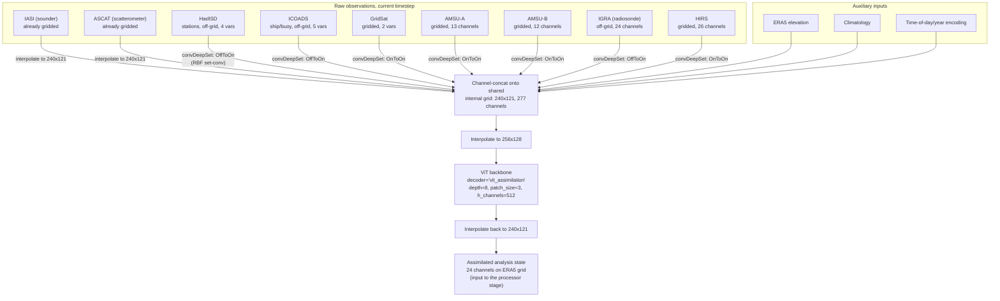

# Assimilation-Only Architecture

This describes the `ConvCNPWeather` model
([aardvark/models.py](../aardvark/models.py)) running in
`mode="assimilation"` — i.e. the **encoder** stage trained by
[training/train_encoder.sh](../training/train_encoder.sh)
(`--decoder vit_assimilation --in_channels 277 --out_channels 24`). This
stage ingests raw, irregularly-sampled observations from many instruments and
produces a single gridded analysis state — it does not forecast forward in
time or downscale to stations (that's the processor and decoder stages,
respectively).

## Diagram

## Key components

- **Set-convolutions (`convDeepSet`,
  [aardvark/set_convs.py](../aardvark/set_convs.py))** — the ConvCNP
  mechanism that turns each observation modality into a fixed-size gridded
  tensor on a shared internal grid (`int_grid`, 240×121 points spanning the
  globe). Each modality gets its own set-conv(s) per channel, with a learned
  RBF length-scale (`init_ls`). Two conversion modes are used here:
  - `OffToOn` — irregular point observations (HadISD, ICOADS, IGRA) → grid.
  - `OnToOn` — already-gridded but differently-resolved products (GridSat,
    AMSU-A/B, HIRS) → the shared internal grid.
  - IASI and ASCAT skip the set-conv and are directly interpolated, since
    they arrive pre-gridded at compatible resolution.
  - Every set-conv also emits a **density channel** marking where
    observations existed, so the model can distinguish "no data" from "zero
    value."

- **Auxiliary channels** — static elevation, a climatological prior, and a
  time encoding are broadcast to the grid and concatenated alongside the
  observation channels, giving `in_channels=277` total.

- **ViT backbone (`decoder_lr`, [aardvark/vit.py](../aardvark/vit.py))** —
  when `decoder="vit_assimilation"`, a Vision Transformer (depth 8,
  patch size 3, hidden size 512, no per-variable embedding) processes the
  concatenated 256×128 field and produces the 24-channel output
  (`out_channels=24`), representing the assimilated atmospheric state.

- **Grid resampling** — inputs are bilinearly interpolated 240×121 →
  256×128 before the ViT (patch-friendly resolution) and the ViT output is
  interpolated back down to 240×121 to match the ERA5 grid.

See [aardvark/models.py:308-390](../aardvark/models.py) (`ConvCNPWeather.forward`,
the `mode == "assimilation"` branch) for the exact code this diagram traces.
